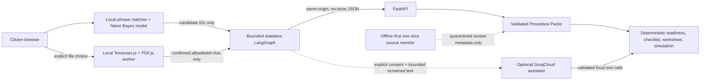

# Sahayi

Sahayi is a privacy-first multilingual public-service preparation prototype. It identifies a supported verified procedure, asks the required questions, automatically prepares a personalised checklist and demonstration worksheet, and guides the citizen to the official channel when official action is required.

**Public demo:** [https://sahayi.onrender.com](https://sahayi.onrender.com)

The public URL is updated only through the verified test/deployment-branch and hosted-release process described below.

## Why Sahayi

Government portals often assume that a person already knows the responsible department, scheme name, and correct channel. Sahayi starts with the citizen's need, proposes a supported service locally, asks for confirmation, and then presents a source-linked, step-by-step journey. It is designed for citizens and assisted-kiosk operators who need plain guidance in English, Hindi, or Malayalam.

This release supports exactly two services:

- UIDAI Aadhaar address update
- Kerala Indira Gandhi National Old Age Pension preliminary guidance

English is the canonical verified guidance. Hindi and Malayalam are machine-assisted prototype translations that require native-speaker and legal review; linked official wording prevails.

## Citizen journey

1. Choose English, Hindi, or Malayalam, press **Start**, and enter one conversation with text or optional voice; browsing the two verified services remains secondary.
2. The browser blocks obvious identifier-shaped input, then combines deterministic Procedure Pack phrases with a bundled Naive Bayes classifier. Finder text is not sent online.
3. Confirm the proposed verified service. Ambiguous address requests inside the pension task are clarified using only catalogue entries.
4. Stay in the same conversation while Sahayi asks one verified readiness or preparation question at a time. Confirmed answers immediately fill one browser-memory preparation record; already completed fields are skipped.
5. At a relevant document question, optionally choose a JPEG, PNG, WebP, or PDF for browser-local printed-text OCR. The file, OCR text, and suggested personal value never leave the browser. A confirmed allowlisted clue can fill its mapped preparation field locally while only the clue category ID reaches the stateless graph.
6. Sahayi continuously recomputes deterministic readiness and the checklist, shows missing fields, and produces a populated printable sheet with the exact `DEMO — NOT FOR SUBMISSION` watermark. The citizen can review and edit locally entered values before the verified official handoff.
7. Detailed provenance and synthetic demo views remain secondary. The optional GroqCloud assistant remains separately disclosed and consent-gated when configured; it is not required for the deterministic conversation.
8. Select **Start Over** or **End session** at any time; navigation, language change, cancellation, replacement, errors, unmount, and inactivity also terminate active document work and clear ephemeral content.

## Architecture



The production image builds React with Vite and serves the compiled files and `/api/v1` API from one unprivileged FastAPI container. There is no citizen database or durable server session.

## Feature status

| Area | Status | Boundary |
| --- | --- | --- |
| Unified conversation, local service finder, bounded LangGraph, automatic browser-memory field filling/readiness/checklist/preparation/handoff, End Session and inactivity clearing | Fully working and deterministic | Stateless graph receives only field IDs and safe structural state; no personal preparation value or AI decides facts/outcomes |
| Optional local document helper | Browser-local progressive enhancement for printed JPEG/PNG/WebP and up to three PDF pages | Tesseract.js/PDF.js assets are pinned and self-hosted; OCR is uncertain and is not authenticity or government validation |
| Procedure Pack provenance, version selection, freshness, fee-conflict display and schema validation | Fully working and deterministic | Active packs fail closed; reviewed facts remain source-linked |
| Optional “Ask Sahayi AI” guidance | Consent-gated GroqCloud feature; disabled without both flag and server key | Groq's selected model may guide tool order/prose, while Sahayi validates output and reconstructs facts/actions from deterministic results |
| Voice input and read-aloud | Progressive browser enhancement | Explicit start only; browser/vendor recognition may not be on-device; transcript is memory-only and text remains complete fallback |
| Conversation-driven preparation | Populated demonstration preparation sheet plus separate synthetic persona demo | Citizen values remain editable in React memory, unsupported/identifier fields stay blank, every sheet is watermarked, and no government contact occurs |
| Live submission, real status, OTP/payment, DigiLocker, certified translation and automatic fact activation | Out of prototype scope | No integration or production claim |

## Local matching ensemble

The browser first runs a reproducible locale-specific phrase scorer over the active catalogue. It also runs a bundled character 2–5-gram Multinomial Naive Bayes classifier trained offline with Python's standard library on 81 owned synthetic examples. TypeScript inference is synchronous and dependency-free: no browser LLM, WebGPU, WASM, runtime model download, generation, or network request.

Agreement can propose the shared allowlisted service; one-sided confidence still requires confirmation; disagreement becomes a choice; unsupported or dual abstention never claims a service. An invalid artifact silently falls back to the phrase matcher. The model cannot change eligibility, readiness, fees, sources, or Procedure Packs. See the [model card](docs/intent-model-card.md) for digests and the synthetic-only evaluation caveat.

## Procedure Packs and trust

Versioned JSON [Procedure Packs](procedure-packs/README.md) hold facts, localized text, deterministic readiness rules, citations, review dates, and lifecycle state. Strict Pydantic validation permits one active version per service, excludes draft/superseded packs, checks every reference and translation key, and produces a canonical SHA-256 digest. Response-time freshness uses `review_due_at`; stale guidance is labeled rather than silently treated as current.

Conflicting official claims are preserved independently with their sources. Sahayi does not pick an unsupported winner: the current UIDAI fee conflict remains visible, and the Kerala pension amount is omitted pending authoritative resolution. Procedure Intelligence is an offline-first, bounded one-shot comparison tool. A read-only daily GitHub Actions invocation may create a review artifact, but it never edits or activates facts; changed, error, and missing-baseline states fail visibly and require human review.

## Privacy and safety boundary

Finder text, match results, conversation history, preparation values and their source/confirmation/validation/edit metadata, checklist, worksheet, and document suggestions stay in React memory. Conversation turns send only allowlisted service/question IDs, safe readiness categories, completed/missing field IDs, and confirmed document-clue category IDs. Names, addresses, form values, document files, filenames, raw OCR text, identifier-shaped OCR values, canvases, and worker state never enter FastAPI, LangGraph, Groq, logs, telemetry, or browser storage. Static OCR runtime assets may use ordinary HTTP caching; citizen-derived content is not placed in cookies, local/session storage, IndexedDB, Cache Storage, service workers, filesystem APIs, logs, or server state. API responses use `Cache-Control: no-store`.

The graph uses one typed state machine with safety/consent, intent clarification, procedure routing, document evidence, interview/readiness, parallel checklist/preparation, explanation, and official-handoff nodes. It has no checkpointer, store, thread persistence, database, LangSmith tracing, or telemetry. Browser-carried state is revalidated against the current active Procedure Pack on every turn.

The optional assistant requires affirmative consent and sends only a minimized, identifier-screened current message plus at most four memory-only turns. Its server-only key, prompts, provider output, and tool arguments are not exposed to the browser. Groq collects usage metadata; Zero Data Retention is an owner-controlled Groq Console setting that Sahayi code does not enable or guarantee. Browser recognition may use browser/vendor processing and is not guaranteed to remain on-device; Sahayi never persists audio or transcripts. See [Privacy and safety](docs/privacy-boundary.md).

## Local development

Verified release runtimes are Python 3.14.7 and Node.js 25.2.1.

```bash
python3 -m venv .venv
. .venv/bin/activate
python -m pip install -e '.[test]'
cd frontend
npm ci
```

Run the backend and frontend in separate shells:

```bash
. .venv/bin/activate
uvicorn sahayi_api.main:app --host 127.0.0.1 --port 8000 --reload
```

```bash
cd frontend
npm run dev
```

Open `http://127.0.0.1:5173`. The default development configuration uses `http://127.0.0.1:8000/api/v1`.

## Verification

```bash
# Complete backend and offline-agent suite
.venv/bin/python -m pytest
.venv/bin/python -m pytest tests/test_agent_evals.py

# Frontend lint, types, tests and production build
cd frontend
npm run lint
npm run typecheck
npm test
npm run ocr:check
npm run build
cd ..

# Model and Procedure Pack integrity/drift
.venv/bin/python -m tools.intent_model --check
.venv/bin/python -m tools.intent_model --evaluate
.venv/bin/python -m sahayi_api.procedure_tool validate
.venv/bin/python -m sahayi_api.procedure_tool check-schema

# Dependency and patch checks
.venv/bin/python -m pip check
.venv/bin/pip-audit --skip-editable
cd frontend && npm audit && cd ..
git diff --check
```

Canonical model regeneration is `python -m tools.intent_model --write`; use it only for an intentional reviewed model change. Schema regeneration is `python -m sahayi_api.procedure_tool export-schema`; use it only for an intentional contract change.

Build and run the same-origin container:

```bash
docker build --no-cache -t sahayi:release-candidate .
docker run --rm --name sahayi-rc -p 10000:10000 sahayi:release-candidate
curl -fsS http://127.0.0.1:10000/api/v1/health
```

The Docker image must run as UID/GID 10001, serve hashed frontend assets, include the active Procedure Packs and compiled local model, and return `Cache-Control: no-store` on important API responses.

## Configuration

Copy `.env.example` to an ignored `.env` only for local configuration. Deterministic Sahayi needs no secret.

| Variable | Purpose |
| --- | --- |
| `SAHAYI_DEV_FRONTEND_ORIGIN` | Exact permitted Vite development origin |
| `VITE_API_BASE_URL` | Development-only frontend API base |
| `SAHAYI_KIOSK_INACTIVITY_SECONDS`, `SAHAYI_KIOSK_WARNING_SECONDS` | Bounded public inactivity/warning durations |
| `GROQ_API_KEY` | Optional server-only secret; use a secret manager, never frontend code or Git |
| `SAHAYI_AGENT_ENABLED` | Explicit optional-agent feature flag; defaults to false |
| `SAHAYI_AGENT_PROVIDER` | Fixed allowlisted provider; defaults/falls back to `groq` |
| `SAHAYI_AGENT_MODEL` | Fixed allowlisted `openai/gpt-oss-120b` Groq model name |
| `SAHAYI_AGENT_TIMEOUT_SECONDS`, `SAHAYI_AGENT_MAX_OUTPUT_TOKENS` | Bounded provider timeout/output controls |
| `SAHAYI_AGENT_MAX_TOOL_CALLS`, `SAHAYI_AGENT_MAX_ROUNDS` | Bounded tool-loop controls |
| `SAHAYI_AGENT_CONCURRENCY`, `SAHAYI_AGENT_REQUEST_BUDGET` | Process-local concurrency/request limits |
| `SAHAYI_AGENT_RATE_LIMIT`, `SAHAYI_AGENT_RATE_WINDOW_SECONDS` | Process-local rate window controls |

## Render deployment

`render.yaml` preserves the existing one-service Docker architecture, `/api/v1/health`, disabled auto-deploy, an unset `GROQ_API_KEY` prompt (`sync: false`), the fixed Groq provider/model, and disabled agent flag. Promotion requires an exact tested deployment-branch commit, one manual Render deploy, and the hosted checks in [`.ai/DEPLOYMENT.md`](.ai/DEPLOYMENT.md).

The selected runtime model is `openai/gpt-oss-120b`. The `openai/` prefix is Groq's model namespace; it does not switch Sahayi to OpenAI. Sahayi still authenticates only with the server-side `GROQ_API_KEY` and calls Groq's fixed `https://api.groq.com/openai/v1` endpoint. Groq officially recommends this model as a replacement for the retired `llama-3.3-70b-versatile`; its current model and rate-limit pages show a non-preview model with free-plan availability, local tool use, JSON/JSON Schema support, and multilingual capability. These fit Sahayi's bounded local-tool design. Sahayi does not enable the model's built-in browser search, code execution, MCP/remote tools, or arbitrary functions, and it does not set optional reasoning or provider-specific parameters.

Groq's current published free-plan row for this model is 30 requests/minute, 1,000 requests/day, 8,000 tokens/minute, and 200,000 tokens/day. These figures are indicative and can change; operators must use their Groq Console for the exact limits applied to their organization. Provider errors, including rate limits, continue to return deterministic Sahayi guidance. There is no automatic second-model fallback.

## Known limitations and disclaimers

- Sahayi is a hackathon prototype, not a government service and not affiliated with or endorsed by UIDAI, the Government of Kerala, or any department.
- Guidance is not legal advice, an eligibility decision, approval, or application submission. Always confirm with the linked official service.
- Only two services are supported. There is no real government form submission, OTP/payment handling, status lookup, or application tracking.
- Model evaluation uses a tiny fixed synthetic dataset; it is not evidence of verified real-world accuracy, fairness, or production readiness.
- Hindi/Malayalam dataset phrases and UI/procedure translations still need native-speaker and legal review; they are not certified translations.
- The reviewed UIDAI sources disagree on the applicable update fee, so Sahayi shows the conflict. The Kerala pension amount is deliberately omitted.
- Source monitoring consists of bounded one-shot checks, optionally scheduled daily, with human review and no automatic activation. It is not continuous fact updating. There is no production, universal retention, or Zero Data Retention claim.
- Voice availability and pronunciation depend on the browser and installed voices; pronunciation and complete accessibility coverage are not certified.
- Local OCR supports bounded printed text and can be slow or wrong, especially for handwriting or poor scans. It is optional preparation assistance—not document authenticity, acceptance, eligibility, or government verification.
- Groq records `llama-3.3-70b-versatile` as retired for free/developer-tier use on 2026-08-16 and recommends `openai/gpt-oss-120b` as a replacement. The retired name is historical migration context only; this candidate made no live provider call.
- Groq account/tier rate limits may be low or change over time. The published free-plan figures above are indicative; exact organization limits belong in Groq Console. HTTP 429 and provider failures return generic deterministic fallback; Sahayi's in-process limits are demo safeguards, not a guarantee of cloud availability.

## Technology and official sources

Sahayi uses React, TypeScript, Vite, FastAPI, Pydantic, Uvicorn, HTTPX, LangGraph, Tesseract.js, PDF.js, a standard-library Naive Bayes trainer, and an optional Groq Chat Completions local-tool integration through its documented OpenAI-compatible endpoint. LangGraph and the seven registered deterministic tools remain application-controlled. Each Groq request receives only its node-specific zero-argument subset (at most two tools), while validated locale, service, readiness, persona, and demo-status state is bound locally before canonical Pydantic execution. Tool arguments and results are validated locally, the final post-tool request disables tool choice, government facts and official URLs remain deterministic, the Groq key stays server-only, and provider failure preserves deterministic guidance. The active packs cite official sources including UIDAI's [Updating Data on Aadhaar](https://uidai.gov.in/en/updating-data-on-aadhaar) and [Enrolment & Update](https://uidai.gov.in/en/enrolment-and-update), and Kerala Sevana's [old-age-pension criteria](https://welfarepension.lsgkerala.gov.in/FAQsEng.aspx?pentypeid=2), [application forms](https://welfarepension.lsgkerala.gov.in/ApplicationFormsEng.aspx), and [IGNOAPS form](https://welfarepension.lsgkerala.gov.in/Application%20form/IGNOAPS.pdf).

Deeper documentation: [architecture](docs/architecture.md), [privacy and safety](docs/privacy-boundary.md), [Procedure Packs](procedure-packs/README.md), [on-device model](docs/intent-model-card.md), and [deployment](.ai/DEPLOYMENT.md).

## Built with Codex

Codex assisted with repository analysis, implementation, tests, documentation, and release verification. It is a development tool, not a runtime dependency and not a source of citizen-facing procedure facts.
