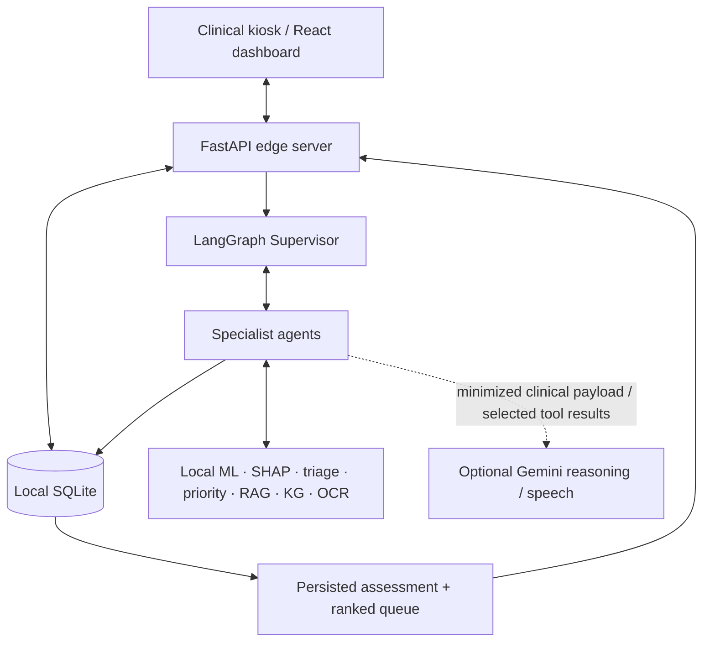
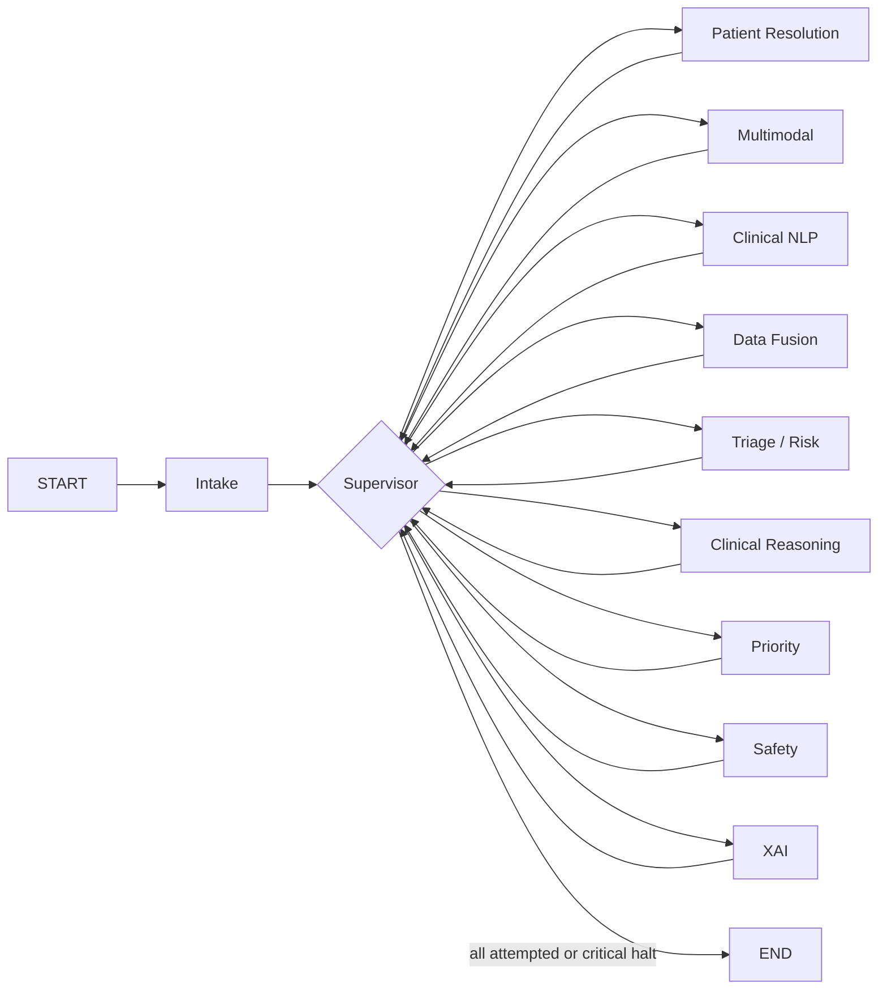
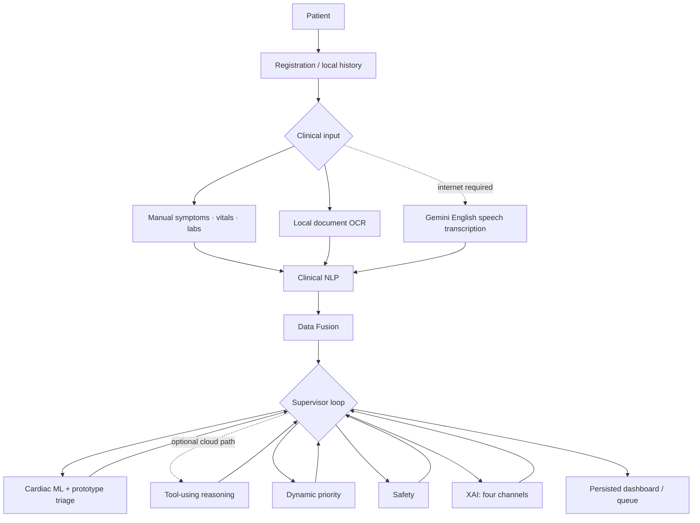
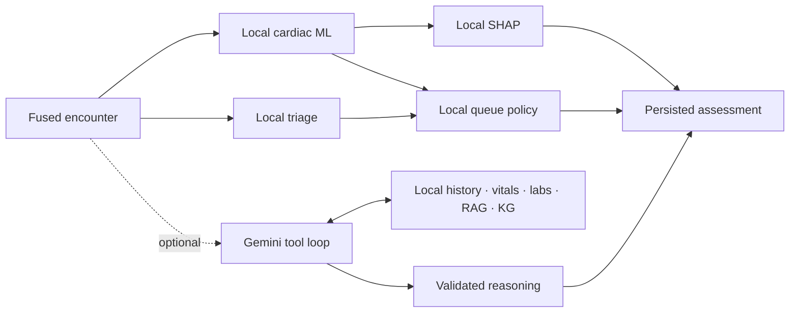
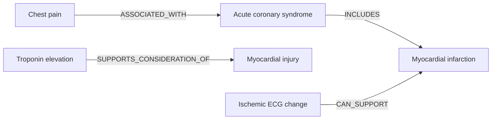

# NextCare

**NextCare — Edge-First Multi-Agent Clinical Intelligence & Emergency
Decision-Support Platform**

NextCare joins a local FastAPI/LangGraph workflow, conventional cardiac-risk
ML, SHAP, provisional ESI-informed triage, an auditable dynamic queue, local
document OCR, optional Gemini speech/reasoning, and a React/TanStack Start clinical
dashboard.


## Problem and approach

Emergency intake mixes longitudinal history, rapidly changing observations,
laboratory reports, spoken symptoms, evidence review, and operational queueing.
One opaque score cannot safely answer all of those questions. NextCare keeps
four outputs explicitly separate:

1. **Cardiac risk probability** — what a dataset-bound classifier recognizes.
2. **Emergency severity** — what a narrow deterministic triage rule set matches.
3. **Clinical reasoning** — what evidence-backed qualitative considerations an
   optional tool-using LLM can assemble.
4. **Queue priority** — how a deterministic operational policy orders waiting
   encounters.

That separation makes missing data, provenance, provider failure, model behavior,
clinical-rule matches, and queue logic independently reviewable.

## What is actually implemented

- Local SQLite patient, encounter, history, symptom, repeated-vital, generic-lab,
  provenance, assessment-history, queue, upload-result, and audit persistence.
- A deterministic Supervisor-directed LangGraph with eleven named agents.
- Random Forest `cardiac-risk-rf-1.0.0` and persisted Tree SHAP contributions.
- `NEUROBOTS Prototype ESI Subset` `prototype-esi-subset-1.0.0`.
- Optional Gemini clinical reasoning with five allow-listed local tools, strict
  structured output, a 12-chunk local RAG corpus, and a 17-edge local KG.
- `NEUROBOTS Dynamic Priority Policy` `dynamic-priority-1.0.0`, repeated-vital
  deterioration, a current queue projection, and append-only calculations.
- Local Tesseract/Poppler document OCR plus conservative lab extraction.
- Optional Gemini Whisper English transcription plus local negation-aware symptom
  extraction.
- A server-authoritative React 19/TanStack Start dashboard using persisted APIs;
  obsolete mock clinical features were removed.

Not implemented: full ESI, medical-image diagnosis, live wearable ingestion,
external EHR integration, medication/prescription intelligence, autonomous
treatment, or regulatory-grade deployment controls.

## Quick Start

### Prerequisites

| Requirement | Actual constraint / verification |
| --- | --- |
| Python | `>=3.12,<3.14`; verified with 3.13.12. Host Python 3.14 is unsupported. |
| `uv` | Not pinned; locked sync verified with 0.10.10. |
| Node.js | Vite 8 requires `^20.19.0` or `>=22.12.0`; verified with 25.2.1. |
| npm | Lockfile v3; verified with 11.6.2. |
| SQLite | Used through Python/SQLAlchemy; no separate server. |
| OCR runtime | Tesseract and Poppler `pdftoppm`; verified at 5.5.3 and 26.07.0. Install English Tesseract data for English documents. |
| Browser | Current JavaScript browser; `MediaRecorder` and microphone permission are needed only for recording speech. |

### Clean install

From a fresh clone:

```bash
cd backend
uv sync --extra dev --locked
cp .env.example .env
.venv/bin/alembic upgrade head
```

> [!IMPORTANT]
> `backend/data/raw/` and `backend/ml/artifacts/` are intentionally Git-ignored.
> A normal clone starts safely, but cardiac inference and SHAP remain unavailable
> until the approved dataset/model is provisioned. To reproduce it, place the
> checksum-bound `Heart Attack.csv` in `backend/data/raw/`, then run
> `.venv/bin/python ml/train_cardiac_model.py` from `backend/`. Do not substitute
> or automatically download restricted clinical data.

Install the frontend from its lockfile:

```bash
cd ../frontend
ELECTRON_SKIP_BINARY_DOWNLOAD=1 npm ci --ignore-scripts
```

### Run

Terminal 1:

```bash
cd backend
.venv/bin/uvicorn app.main:app --host 127.0.0.1 --port 8000 --reload
```

Terminal 2:

```bash
cd frontend
npm run dev -- --host 127.0.0.1 --port 5173
```

- Dashboard: <http://127.0.0.1:5173>
- Health: <http://127.0.0.1:8000/health>
- Swagger: <http://127.0.0.1:8000/docs>
- OpenAPI: <http://127.0.0.1:8000/openapi.json>

Locked installation, Alembic upgrade/current, backend startup, Vite dev startup,
production client/SSR build, and preview were exercised on the verification
workstation. Restricted sandboxes may need permission to bind loopback ports.

## Why NextCare is agentic

This is not simply `API -> model.predict()`. Intake loads the current encounter;
a LangGraph Supervisor repeatedly inspects shared `ClinicalState`, selects the
next incomplete specialist, regains control after every attempt, and terminates
on completion or critical halt. The current routing policy is deterministic and
completion-state aware—it is not an LLM planner, and normally attempts specialists
in a fixed policy order.

The Clinical Reasoning specialist is genuinely tool-using: Gemini dynamically
chooses a useful subset and order of five controlled local tools. Tool arguments
are validated, identifiers are bound locally, duplicate calls and execution
budgets are enforced, evidence provenance is retained, and final visible output
must satisfy a strict schema. Hidden chain-of-thought is neither requested nor
persisted.

| Concept | Role in NextCare |
| --- | --- |
| Agent | Traceable LangGraph node that reads and updates shared clinical state. |
| Tool | Narrow callable capability such as risk inference or corpus retrieval. |
| Deterministic clinical service | Reproducible validation, fusion, triage, safety, persistence, or queue policy. |
| ML model | Trained statistical classifier producing cardiac positive-class probability. |
| LLM reasoning | Optional Gemini tool selection and evidence-backed synthesis; it never controls ML, triage, or queue order. |

Deterministic logic is used where explicit, auditable behavior matters. The LLM
is isolated to optional clinical reasoning rather than replacing every service.

## Architecture



The backend is a local modular monolith. LangGraph runs inside FastAPI;
SQLAlchemy repositories/services isolate persistence. The UI does not infer
clinical results or reorder patients—it writes inputs and reads persisted
assessment/queue projections.

### Supervisor flow



The implemented specialist order is Patient Resolution, Multimodal, Clinical
NLP, Data Fusion, Triage/Risk, Clinical Reasoning, Priority, Safety, and XAI.
Intake is critical; specialist exceptions become inspectable failed trace entries,
and non-critical failures are isolated.

### Agent responsibilities

| Agent | Purpose / major inputs | Major outputs | Method and important failure behavior |
| --- | --- | --- | --- |
| Supervisor | Completion, halt, trace metadata. | Next action and workflow status. | Deterministic policy; 12-decision guard. |
| Intake | Patient/encounter IDs and current database state. | Encounter, symptoms, vitals, labs, missing categories. | Repository validation; ownership/identity failure halts. |
| Patient Resolution | Patient ID and current encounter ID. | Demographics, prior encounters, returning flag. | Local deterministic lookup. |
| Multimodal | Persisted OCR documents, speech records, observation sources. | OCR/transcript summaries, provenance, conflicts, capability status. | Loading only; ingestion occurs through explicit APIs. |
| Clinical NLP | Structured and speech-derived symptoms. | Normalized symptoms retaining `present`, source, and original text. | Deterministic normalization/extraction. |
| Data Fusion | Patient/history, normalized symptoms, all vitals/labs. | Current symptom view, latest/previous vitals, labs by test, fused provenance/conflicts. | Manual symptom/lab assertions take precedence; all observations remain stored. |
| Triage/Risk | Fused state and eight cardiac features. | Cardiac result/missing input plus persisted provisional triage. | Local ML + deterministic policy; triage runs even when ML cannot. |
| Clinical Reasoning | Minimized state and controlled tools. | Qualitative differentials, correlations, evidence, missing data, uncertainty, tool trace. | Optional Gemini; provider/timeout/schema failure becomes persisted pending/partial. |
| Priority | Usable persisted triage, cardiac support, vital history, waiting time. | Queue score/band/rank, deterioration, rule trace. | Deterministic; undetermined triage creates no queue row. |
| Safety | Assessment channels, state freshness, errors/missing data. | Deterministic findings and sanitized inconsistent unavailable output. | Validates; never assigns severity or priority. |
| XAI | Prediction, triage, reasoning, priority, agent trace. | Four separate explanation channels; persisted SHAP if prediction exists. | Partial without a cardiac prediction. |

### Shared `ClinicalState`

Agents communicate through one typed, JSON-safe state rather than direct
agent-to-agent calls. Its major categories are:

- workflow identity: workflow, patient, and encounter IDs;
- patient context: patient, history, returning status;
- encounter facts: symptoms, repeated vitals, generic labs;
- multimodal input: OCR documents/text, speech results/transcript, explicit
  pending image/wearable slots;
- normalized/fused data: normalized symptoms, latest and previous vitals, latest
  labs, provenance, conflicts;
- assessment channels: cardiac risk, triage, reasoning, safety, XAI, priority;
- orchestration: next action, completed agents, warnings/errors, capability
  status, halt flag, and ordered `agent_trace`.

### End-to-end data flow



### Fast path and optional reasoning path



The `<500 ms` target refers only to the measured warm local component path. It
does not include HTTP, LangGraph, SHAP, or Gemini network latency unless a specific
measurement says otherwise.

## Cardiac Risk Prediction

The approved `Heart Attack.csv` is identified as *An Extensive Dataset for the
Heart Disease Classification System* (`doi:10.17632/65gxgy2nmg.2`). It contains
1,319 records; its checksum and exact schema are pinned in
[`backend/ml/feature_schema.json`](backend/ml/feature_schema.json). Preparation
removes exact duplicates, rejects missing required values, and excludes 11
invalid rows: three heart rates above 300 and eight diastolic readings above
systolic. That leaves 1,308 records.

| Raw column | Internal feature |
| --- | --- |
| `age` | `age` |
| `gender` | `gender` (female `0`, male `1`) |
| `impluse` | `heart_rate` |
| `pressurehight` | `systolic_bp` |
| `pressurelow` | `diastolic_bp` |
| `glucose` | `blood_sugar` |
| `kcm` | `ck_mb` |
| `troponin` | `troponin` |

No unit conversion or glucose binarization occurs: source units/assays are not
dependably documented, and glucose metadata conflicts with the continuous file.

A seed-42 stratified 80/20 split produces 1,046 training and 262 untouched test
rows at threshold 0.5:

| Model | Accuracy | Precision + | Sensitivity + | Specificity | F1 + | ROC-AUC |
| --- | ---: | ---: | ---: | ---: | ---: | ---: |
| Logistic Regression | 0.7786 | 0.9256 | 0.6957 | 0.9109 | 0.7943 | 0.8933 |
| Random Forest | 0.9885 | 0.9877 | 0.9938 | 0.9802 | 0.9907 | 0.9990 |

Random Forest was selected for higher positive-class sensitivity and Tree SHAP
compatibility. The high score likely reflects contemporaneous troponin/CK-MB and
must not be generalized beyond this dataset. It is not external, prospective, or
clinical validation.

Successful executions append `RiskPrediction` and `Explanation`; incomplete
input reports the missing features and persists no prediction. The artifact path
is `backend/ml/artifacts/cardiac_risk_random_forest_v1.0.0.joblib`.

> **Cardiac probability != emergency severity != operational priority.** The
> classifier does not assign ESI or queue rank.

## Emergency Triage

`NEUROBOTS Prototype ESI Subset` is informed by the Emergency Nurses Association
*ESI Handbook, Fifth Edition* and the AHRQ ESI overview. It implements:

- `TRIAGE-001`: adult heart rate >100, respiratory rate >20, or SpO2 <92;
- `TRIAGE-002`: current chest pain plus dyspnea or sweating;
- `TRIAGE-003`: reported symptom severity >=7 as support only;
- `TRIAGE-004`: positive cardiac output at probability >=0.8 as support only;
- `TRIAGE-005`: missing full-ESI inputs and provisional gating.

A clinical rule match may emit `PROTOTYPE_ESI_2`; otherwise it emits
`UNDETERMINED`. Every result is provisional. The code never emits level 1 and
cannot distinguish levels 3–5 because it lacks immediate-intervention, mental
status, clinician high-risk, and anticipated-resource inputs. This is **not full
or validated ESI**.

Each run appends the policy/version, severity, rule trace, completeness,
confidence status, missing information, exact snapshot, latency, and timestamp.
Reassessment means appending a newer vital and explicitly rerunning the workflow.

## Agentic Clinical Reasoning

`LLMProvider` is the replaceable interface; `GeminiProvider` is implemented.
`GEMINI_MODEL` defaults to `gemini-3.6-flash`. The LLM may dynamically choose:

| Approved tool | Controlled local result |
| --- | --- |
| `get_patient_history` | Up to five clinically relevant prior encounters. |
| `get_current_vitals` | Latest vitals with timestamp/source. |
| `get_current_labs` | Up to 20 relevant current labs. |
| `retrieve_clinical_guidelines` | Attributed matches from the local corpus. |
| `query_medical_knowledge_graph` | Attributed constrained graph edges. |

There is no fixed tool sequence. The loop allows at most six model steps, five
tool calls, and 45 seconds, validates arguments, and blocks duplicate calls.
Final `clinical-reasoning-output-1.0.0` contains a summary, qualitative
differentials, symptom associations, actual RAG/KG evidence, missing information,
evidence-backed considerations, uncertainty, limitations, and visible tool
trace. It rejects invented disease probabilities and never stores chain-of-thought.

Missing key, timeout, API/provider error, changed model identity, duplicate/tool
exhaustion, or invalid output becomes an append-only pending/partial result. Local
ML, triage, queue, Safety, and XAI continue.

## Retrieval-Augmented Generation

Corpus `acs-corpus-1.0.0` contains 12 compact, attributed chunks about suspected
ACS, MI, and emergency chest pain. Sources cover ACC/AHA/ACEP/NAEMSP/SCAI ACS
material, 2021 AHA/ACC Chest Pain, 2023 ESC ACS, the Fourth Universal Definition
of MI, CDC, and AHA patient information.

- Local `HashingVectorizer`, English word unigrams/bigrams, L2 normalization.
- `sklearn-hashing-vectorizer-word-bigram-v1`, 4,096 dimensions.
- Index `clinical-hashing-index-1.0.0`, compressed NumPy.
- Query <=500 characters; `top_k` 1–5; snippet <=900; score floor 0.08.
- Results retain chunk/source ID, title, organization, section, URL, document
  date, corpus version, and score.

This is lightweight lexical retrieval, not a comprehensive semantic medical
model; the corpus is intentionally narrow.

## Medical Knowledge Graph

`acs-kg-1.0.0` is a local NetworkX `MultiDiGraph`: 17 nodes and 17 curated edges
across symptoms, conditions, findings, tests, and evaluations. Every edge retains
an edge ID, relationship, source ID/reference, and graph version. Text lookup is
capped at 300 characters and eight results. Arbitrary graph code, SQL, HTTP,
browser, filesystem, and shell access are not exposed.



KG evidence reaches reasoning only when the LLM chooses the KG tool; edge/source
IDs persist in the reasoning result and its XAI evidence channel.

## Explainability

Four channels are intentionally separated:

1. **ML contributions** — Tree SHAP base value and ranked observed-feature
   contributions/directions for the cardiac classifier.
2. **Triage trace** — deterministic `TRIAGE-*` inputs, triggers, effects, policy,
   provisional state, and missing data.
3. **Reasoning evidence** — provider/model status, controlled tool trace, RAG
   chunks, KG edges, qualitative differentials, and limitations.
4. **Priority trace** — deterministic `PRIORITY-*` score contributions,
   deterioration, waiting adjustment, reasons, and policy.

An ML contribution is not a clinical rule; LLM prose is not a probability; queue
rank is not severity. SHAP explains model behavior, not clinical causation.

## Dynamic Priority Queue

`QueueEntry` is the current one-per-encounter projection;
`QueuePriorityCalculation` is append-only history. Statuses are `WAITING`,
`CALLED`, `IN_ASSESSMENT`, `COMPLETED`, and `REMOVED`. Completed/removed are
terminal and leave the default waiting list.

The policy requires successful, determinate, persisted triage:

- `PRIORITY-001`: dominant severity base (`PROTOTYPE_ESI_2`/`VERY_HIGH` = 75;
  supported internal bases range 20–90);
- `PRIORITY-002`: +15 for supported deterioration;
- `PRIORITY-003`: +5 for successful positive cardiac output >=0.8;
- `PRIORITY-004`: +1 per 30 wait minutes, capped +5;
- `PRIORITY-005`: provisional flag, no score penalty.

Scores cap at 100 and map to `CRITICAL`, `VERY_HIGH`, `HIGH`, `MODERATE`, or
`ROUTINE`. Deterioration compares the latest two readings: heart-rate rise >=20,
systolic-BP drop >=20, SpO2 drop >=3, or respiratory-rate rise >=6. Insufficient
comparable readings produce `UNKNOWN`.

Waiting order is score descending, earlier `waiting_since`, earlier entry
creation, then UUID. Waiting contribution changes only on explicit recalculation;
there is no background scheduler.

## Clinical Document OCR

`POST /api/encounters/{id}/documents` accepts signature-matching PNG, JPEG, TIFF,
WebP, or PDF bytes with `Content-Type` and `X-Filename`. Local Tesseract uses a
private temporary directory; Poppler renders at most five PDF pages. Defaults are
10 MiB and 30 seconds. Names are sanitized, commands use fixed argument lists,
and original bytes are discarded.

`clinical-document-parser-1.0.0` conservatively extracts numeric troponin, CK-MB,
blood sugar/glucose, creatinine, potassium, haemoglobin/hemoglobin, and WBC. It
persists OCR engine/language, confidence, hash, text, source line, extracted labs,
conflicts, and created lab IDs. Manual and OCR observations both persist; manual
values win the fused current view.

English Tesseract data is preferred. The verified host currently falls back to
the installed Afrikaans Latin-script pack. OCR is printed-document extraction,
**not medical-image diagnosis**.

## Speech-to-Clinical-Text

`POST /api/encounters/{id}/speech` accepts signature-matching WAV, MP3, MP4/M4A,
OGG, WebM, or FLAC. The only adapter uses Gemini
`gemini-3.6-flash`, English `en`, 20 MiB, and a 45-second timeout, so speech
requires internet and `GEMINI_API_KEY`.

Audio bytes are discarded. Transcript, hash, provider/model/language, confidence
availability, latency, conflicts, and linked symptoms persist.
`clinical-text-extractor-1.0.0` recognizes chest pain, shortness of breath,
sweating, nausea, vomiting, dizziness, and palpitations with a small nearby
negation pattern. Manual assertions win fusion conflicts. Provider/signature/
timeout/size/empty-transcript failures do not affect local workflow capabilities.

## Offline and Online Capabilities

| Capability | Offline? | Notes |
| --- | --- | --- |
| Patient database/history/manual input | Yes | Local FastAPI + SQLite. |
| LangGraph and trace | Yes | Runs in the backend process. |
| Cardiac ML | Yes, if provisioned | Requires ignored local `.joblib`. |
| SHAP | Yes, if provisioned | Requires the same artifact. |
| Prototype triage | Yes | Deterministic Python. |
| Queue/deterioration/audit | Yes | Deterministic + SQLite. |
| Clinical NLP | Yes | Deterministic extraction/normalization. |
| RAG and KG | Yes | Tracked local corpus/index/graph. |
| OCR | Yes, with system dependencies | Tesseract/Poppler and language data. |
| Dashboard runtime | Yes | After dependencies/build; uses local API. |
| Gemini clinical reasoning | No | Credentials, provider, and internet required. |
| Gemini speech | No | Credentials, provider, and internet required. |
| Dependency install | Usually no | Requires registries unless cached. |

## Persistence

The default Git-ignored database is `backend/neurobots.db`. Alembic head is
`20260808_0007`.

| Entity | Persisted role |
| --- | --- |
| `Patient` / `ClinicalEncounter` | Demographics, complaint, notes/status, longitudinal relationship. |
| `Symptom` / `VitalSigns` / `LabResult` | Provenance-bearing encounter observations. |
| `RiskPrediction` / `Explanation` | Append-only prediction snapshot/latency and SHAP. |
| `TriageAssessment` | Append-only policy, provisional severity, rules, completeness, input. |
| `ClinicalReasoningResult` | Append-only visible structured result or safe failure/evidence/tool trace. |
| `QueueEntry` | Mutable current operational projection. |
| `QueuePriorityCalculation` | Append-only recalculation history. |
| `ClinicalDocument` | OCR metadata/text/extractions; no original bytes. |
| `SpeechTranscription` | Transcript/provider/extractions; no audio bytes. |
| `AuditEvent` | Patient, encounter, observation, workflow, document, speech, and queue actions. |

## Frontend and Backend Connection

The teammate dashboard's design was retained and connected to persisted backend
capabilities. The single `/` route provides a five-second server-ranked queue
poll, patient search/registration/history, encounter creation/selection, manual
inputs, OCR/audio upload, explicit workflow execution, status changes, and
Overview/Reasoning/Inputs views. It renders loading/provider/backend errors and
has no mock clinical fallback.

`frontend/src/lib/api.ts` centralizes `fetch`, maintained boundary types, stable
error handling, and `VITE_API_BASE_URL` (default `http://127.0.0.1:8000`). The UI
reads `/assessment` and `/queue`; it does not interpret raw `ClinicalState` or
recompute priority.

## Environment Variables

All backend settings have defaults. Gemini is required only for online features.

| Variable | Required? | Purpose / safe example |
| --- | --- | --- |
| `NEUROBOTS_APP_NAME` | No | Historical environment-variable name for the API title; default `NextCare Clinical API`. |
| `NEUROBOTS_ENVIRONMENT` | No | Health label; `development`. |
| `NEUROBOTS_DATABASE_URL` | No | `sqlite:///./neurobots.db`. |
| `NEUROBOTS_HEART_ATTACK_MODEL_PATH` | No | `ml/artifacts/cardiac_risk_random_forest_v1.0.0.joblib`. |
| `NEUROBOTS_CARDIAC_FEATURE_SCHEMA_PATH` | No | `ml/feature_schema.json`. |
| `GEMINI_API_KEY` | Online features only | Secret; blank means offline reasoning/speech. |
| `GEMINI_MODEL` | No | Reasoning model; blank defaults to `gemini-3.6-flash`. |
| `GEMINI_SPEECH_MODEL` | No | Blank defaults to `gemini-3.6-flash`. |
| `NEUROBOTS_CLINICAL_CORPUS_PATH` | No | Local corpus JSON. |
| `NEUROBOTS_CLINICAL_VECTOR_INDEX_PATH` | No | Local NumPy index. |
| `NEUROBOTS_MEDICAL_KNOWLEDGE_GRAPH_PATH` | No | Local KG JSON. |
| `NEUROBOTS_CLINICAL_REASONING_MAX_STEPS` | No | Default `6`. |
| `NEUROBOTS_CLINICAL_REASONING_MAX_TOOL_CALLS` | No | Default `5`. |
| `NEUROBOTS_CLINICAL_REASONING_TIMEOUT_SECONDS` | No | Default `45`. |
| `NEUROBOTS_DOCUMENT_UPLOAD_MAX_BYTES` | No | Default `10485760`. |
| `NEUROBOTS_OCR_TIMEOUT_SECONDS` | No | Default `30`. |
| `NEUROBOTS_OCR_MAX_PDF_PAGES` | No | Default `5`. |
| `NEUROBOTS_TESSERACT_COMMAND` | No | Default `tesseract`. |
| `NEUROBOTS_PDFTOPPM_COMMAND` | No | Default `pdftoppm`. |
| `NEUROBOTS_SPEECH_UPLOAD_MAX_BYTES` | No | Default `20971520`. |
| `NEUROBOTS_SPEECH_TIMEOUT_SECONDS` | No | Default `45`. |
| `NEUROBOTS_CORS_ORIGINS` | No | JSON exact-origin list; `["http://127.0.0.1:5173"]`. |
| `VITE_API_BASE_URL` | No; frontend | Backend origin; `http://127.0.0.1:8000`. |

Backend settings load `backend/.env`; frontend overrides use
`frontend/.env.local`. Both are ignored. Never commit real secrets.

## Database, Demo, and Vertical Slice

From `backend/`:

```bash
.venv/bin/alembic upgrade head
.venv/bin/alembic current
.venv/bin/python -m app.seed
```

`alembic current` reports `20260808_0007 (head)`. The idempotent seed creates ten
clearly synthetic active cases and runs their local workflows with Gemini forced
unavailable. `DEMO-001` has a completed historical encounter, current symptoms,
cardiac-model labs, and two worsening vital snapshots; `DEMO-002`–`010` add
symptom-based cardiac, respiratory, infectious, metabolic, renal, hypertensive,
and injury scenarios. Supported cases enter the ranked queue; cases outside the
narrow prototype triage rules remain in pending intake. Model-specific seed
results require the local artifact.

With backend 8000 and frontend 5173 running—and the model provisioned—run:

```bash
.venv/bin/python scripts/verify_vertical_slice.py
```

It creates additional synthetic records, submits manual symptoms/vitals/labs,
runs two Supervisor assessments, checks cardiac/triage/SHAP/reasoning-attempt/
priority/history/queue persistence, detects worsening vitals, reuses/reorders the
queue entry, exercises `WAITING -> CALLED -> IN_ASSESSMENT`, and confirms the
frontend is served. It mutates the configured development DB; never run it against
production. Current verification passed with reasoning `PENDING_CAPABILITY`.

## API

`/docs` and `/openapi.json` are authoritative. Public groups are:

| Group | Routes |
| --- | --- |
| System | `GET /health` |
| Patients | `POST/GET /api/patients`; `GET /api/patients/{id}` and `/history` |
| Encounters | `POST /api/patients/{id}/encounters`; `GET/PATCH /api/encounters/{id}` |
| Observations | `POST/GET /api/encounters/{id}/symptoms`, `/vitals`, `/labs` |
| Workflow | `POST /api/encounters/{id}/workflow` |
| Assessment | `GET /api/encounters/{id}/assessment`, `/assessment-history` |
| Queue | `GET /api/queue`; `GET/PATCH /api/queue/{queue_entry_id}` |
| OCR | `POST/GET /api/encounters/{id}/documents`; `GET /api/documents/{id}` |
| Speech | `POST/GET /api/encounters/{id}/speech`; `GET /api/speech/{id}` |

Errors use `{"error":{"code":"STABLE_CODE","detail":"...","issues":[]}}`;
validation errors add `issues`. Simulator and legacy `assessment-workflow` paths
remain compatibility-only and are hidden from OpenAPI. See
[`.ai/FRONTEND_API.md`](.ai/FRONTEND_API.md).

## Testing

Backend:

```bash
cd backend
.venv/bin/python -m pytest
.venv/bin/python -m compileall -q app migrations scripts ml triage priority clinical_knowledge
```

Current test result: **94 passed** on Python 3.13.12 / pytest 8.4.2. Tests use
temporary SQLite and scripted/mock providers, clear `GEMINI_API_KEY`, and do not
make live Gemini calls.

Frontend:

```bash
cd frontend
npm run lint -- --quiet
npm run typecheck
npm run build
```

All pass. `npm run build` creates both client and SSR bundles. No frontend test
script is configured.

## Benchmarks

Only tracked JSON measurements are treated as reproducible benchmarks:

| Measurement | Runs | Mean | p50 | p95 | Included/excluded scope |
| --- | ---: | ---: | ---: | ---: | --- |
| `CardiacRiskTool` | 500 | 14.6396 ms | 14.5156 | 15.3315 | Warm local inference; excludes HTTP/LangGraph/SHAP. |
| `EmergencyTriageTool` | 1,000 | 0.0106 ms | 0.0093 | 0.0157 | Standalone deterministic tool. |
| Cardiac + triage | 500 | 14.6359 ms | 14.4580 | 15.5155 | Excludes HTTP/LangGraph/persistence/SHAP. |
| `DynamicQueueService` | 300 | 2.3651 ms | 2.3298 | 2.7503 | Includes SQLite projection/history and focused audit. |
| Cardiac + triage + queue | 300 | 17.2662 ms | 17.1613 | 17.9381 | Excludes HTTP/LangGraph/SHAP/Gemini. |
| Local RAG | 1,000 | 0.3937 ms | 0.3749 | 0.5231 | Warm local component. |
| Local KG | 1,000 | 0.1418 ms | 0.1339 | 0.1881 | Warm local component. |
| Reasoning Agent, zero-latency scripted provider | 200 | 5.7264 ms | 5.3945 | 6.1045 | Includes RAG/KG/validation/SQLite; excludes Gemini. |

The `<500 ms` statement applies to measured combined local components, **not**
cloud reasoning or end-to-end HTTP. No reproducible tracked Gemini network benchmark
exists. See [BENCHMARKS.md](BENCHMARKS.md) and the JSON files under `backend/ml/`,
`backend/triage/`, `backend/priority/`, and `backend/clinical_knowledge/`.

Benchmark commands, from `backend/`:

```bash
.venv/bin/python ml/benchmark_cardiac_model.py
.venv/bin/python triage/benchmark_triage_policy.py
.venv/bin/python clinical_knowledge/benchmark_local_knowledge.py
.venv/bin/python clinical_knowledge/benchmark_reasoning_agent.py
.venv/bin/python priority/benchmark_dynamic_queue.py
```

## Model Reproduction

Place the approved dataset at `backend/data/raw/Heart Attack.csv`, confirm its
SHA-256/columns match `backend/ml/feature_schema.json`, then from `backend/` run:

```bash
.venv/bin/python ml/train_cardiac_model.py
```

It audits/prepares data, performs the fixed split, compares both models, and
writes the ignored artifact plus tracked `ml/model_metadata_v1.0.0.json` and
`ml/dataset_report.json`. Raw data and artifacts remain ignored; do not commit
them without explicit data-governance approval.

## Repository Structure

```text
NextCare/
├── backend/
│   ├── app/
│   │   ├── agents/               # Supervisor, specialists, reasoning tools
│   │   ├── api/routes/           # FastAPI endpoints
│   │   ├── clinical_reasoning/   # Payload, RAG, KG, output schemas
│   │   ├── db/                   # SQLAlchemy models/session
│   │   ├── llm/                  # Provider interface + Gemini
│   │   ├── ml/                   # Dataset, features, inference, SHAP, training
│   │   ├── multimodal/           # OCR, parser, speech, text extraction
│   │   ├── priority/             # Queue and deterioration policies
│   │   ├── services/             # Application/persistence orchestration
│   │   ├── triage/               # Prototype ESI subset
│   │   └── workflows/            # ClinicalState + LangGraph
│   ├── clinical_knowledge/       # Corpus, local index, KG, benchmarks
│   ├── migrations/versions/      # Alembic 0001–0007
│   ├── ml/                       # Training/benchmark scripts and metadata
│   ├── priority/ and triage/     # Benchmarks and demos
│   ├── scripts/                  # Vertical-slice verifier
│   └── tests/                    # 94 backend tests
├── frontend/
│   ├── src/components/           # Queue, intake, assessment, OCR, speech, XAI
│   ├── src/lib/api.ts            # Central API client/types
│   └── src/routes/               # TanStack Start routes
├── BENCHMARKS.md
└── .ai/                          # Architecture, decisions, API, runbooks, state
```

## Kiosk / Deployment Model

The repository supports direct local processes, not Docker/Kubernetes:

1. Browser/kiosk renders TanStack Start.
2. Local FastAPI runs LangGraph and serves REST/OpenAPI.
3. SQLite, model, corpus/index, KG, OCR, queue, and audit stay on the edge.
4. Optional outbound Gemini serves reasoning/speech only.

For a deployed origin, set `VITE_API_BASE_URL`, set an exact JSON
`NEUROBOTS_CORS_ORIGINS` allow-list, build, and preview/serve:

```bash
cd frontend
VITE_API_BASE_URL=http://127.0.0.1:8000 npm run build
npm run preview -- --host 127.0.0.1 --port 5173
```

Back up SQLite before migrations. Recovery restores the DB plus matching
application/model/corpus versions; discarded document/audio bytes are not
recoverable. The repo has no reverse proxy, auth deployment, container,
orchestrator, or cloud manifest.

## Privacy and Security

Implemented protections:

- local database and deterministic clinical services;
- initial Gemini payload excludes names, phone, external/database IDs, exact DOB,
  and raw notes, using approximate age;
- patient/encounter IDs bound locally; exactly five validated tools;
- capped, provenance-bearing tool output;
- ignored `.env`, DB, raw-data, artifact, dependency, and build paths;
- secret settings and sanitized provider errors; keys/raw requests are not
  intentionally logged;
- upload signatures/limits, sanitized filenames, fixed subprocess arguments,
  timeouts, private temp directories, and immediate raw-byte deletion;
- append-only assessment/audit history, failure isolation, and explicit CORS.

The minimized payload/tool results may still contain sensitive clinical facts and
timestamps; explicit speech uploads send audio to Gemini. Deployers must assess
consent, retention, vendor, access, encryption, and networks. Authentication/RBAC,
encryption at rest, cloud sync, and regulatory compliance controls are not
implemented. No HIPAA, GDPR, or other certification is claimed.

## Graceful Degradation

| Failure | Actual behavior |
| --- | --- |
| Gemini unavailable | Reasoning is pending/partial; local records, provisioned ML/SHAP, triage, queue, Safety, and XAI continue. |
| Missing model input | `INCOMPLETE_INPUT`; no prediction/SHAP row. Triage still runs; undetermined triage prevents queue creation. |
| Missing artifact | Cardiac capability unavailable; workflow continues without model contribution. |
| OCR failure | Stable error; no document/lab transaction committed. |
| Speech failure | Stable error; no transcription/symptom transaction committed. |
| Specialist exception | Traceable failure; only a critical Intake failure halts. |

## Hackathon Requirements Mapping

| Requirement | NextCare implementation | Status |
| --- | --- | --- |
| Functional web platform | React/TanStack Start + FastAPI. | Implemented |
| Speech-to-clinical-text | Gemini Whisper English + transcript persistence. | Implemented (online) |
| Symptom extraction | Seven-concept local extractor with limited negation. | Prototype / partial |
| OCR | Local printed-document OCR and lab parser. | Implemented |
| EHR/patient history | Local longitudinal records; no external connector. | Prototype / partial |
| Wearable telemetry | Source/state placeholders only; no adapter. | Not implemented |
| ESI | Auditable always-provisional high-risk subset. | Prototype / partial |
| Prioritization | Deterministic persistent dynamic queue. | Implemented |
| Clinical recommendation | Evidence-backed considerations, not orders. | Prototype / partial |
| Multimodal fusion | Manual + OCR + speech with provenance/conflicts. | Implemented |
| Differential diagnosis | Strict qualitative differential considerations. | Prototype / partial |
| RAG | Local 12-chunk attributed corpus/index. | Implemented (limited) |
| Medical KG | Local 17-node/17-edge source-backed graph. | Implemented (limited) |
| XAI | Separate SHAP, triage, reasoning, priority channels. | Implemented |
| Audit | Workflow/input/upload/queue events + histories. | Implemented |
| Privacy | Local-first/minimized cloud boundary/upload controls. | Prototype / partial |
| Low latency | Stored local-component fast path <500 ms. | Implemented for measured scope |
| Offline | Records/orchestration/triage/queue/RAG/KG/OCR; ML if provisioned. | Implemented / conditional |
| Cloud reasoning | Optional Gemini with controlled tools/failure isolation. | Implemented (online) |
| Multi-agent reasoning | Supervisor graph + tool-using specialist. | Implemented |
| Medical-image interpretation | No imaging model. | Not implemented |

## Deliverables Mapping

| Deliverable | Repository evidence |
| --- | --- |
| Functional Web Platform | `frontend/`, `backend/app/main.py` |
| AI Inference Pipeline | `backend/app/workflows/`, `agents/`, `ml/` |
| Clinical Dashboard | `frontend/src/components/TriageDashboard.jsx` |
| Architecture Diagram | This README; `.ai/ARCHITECTURE.md` |
| API Documentation | `/docs`, `/openapi.json`, `.ai/FRONTEND_API.md` |
| Benchmark Report | `BENCHMARKS.md`; tracked latency JSON |
| Explainability Module | `backend/app/ml/explanation.py`; `XaiAgent` |
| Deployment Guide | This README; `.ai/DEPLOYMENT.md`, `.ai/ENVIRONMENT.md` |

## Limitations

- Hackathon prototype; no autonomous diagnosis/treatment or clinical/regulatory
  validation.
- Single-center cardiac dataset, uncertain units/assays, contemporaneous
  biomarker leakage risk, no external/prospective validation.
- Prototype ESI does not implement level 1 or levels 3–5.
- Small ACS-focused RAG, lexical embeddings, and limited KG.
- Gemini reasoning/speech require approved internet/provider use.
- OCR depends on scan/layout/language quality and extracts a narrow allow-list.
- English-only STT; no calibrated confidence; limited symptom/negation parser.
- No medical-image interpretation, live wearable telemetry, external EHR,
  medication intelligence, clinician override flow, or background queue worker.
- No frontend automation suite, authentication/RBAC, encryption at rest, sync,
  HA/cloud/container deployment, or regulatory certification.
- Raw dataset/model artifact are absent from a normal clone and require approved
  local provisioning.

## Disclaimer

NextCare is for software demonstration and research only. Never use it as the
sole basis for triage, diagnosis, treatment, disposition, or queue decisions.
Follow local emergency protocols and qualified clinician judgment.

Further implementation history: [`.ai/ARCHITECTURE.md`](.ai/ARCHITECTURE.md),
[`DECISIONS.md`](.ai/DECISIONS.md), [`.ai/ENVIRONMENT.md`](.ai/ENVIRONMENT.md),
and [`.ai/WORKFLOW.md`](.ai/WORKFLOW.md).
