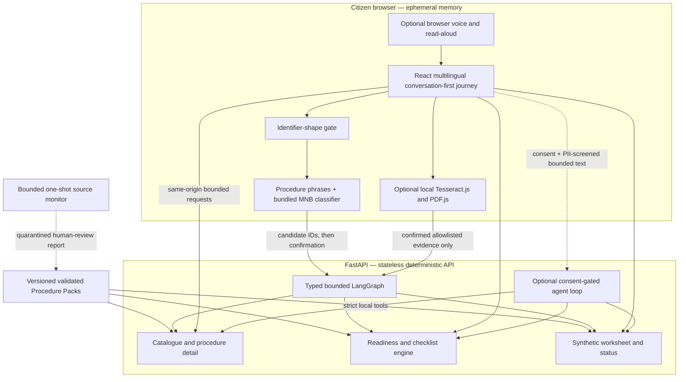

# Architecture

Sahayi is a same-origin React/TypeScript and FastAPI application with four deliberately separate trust boundaries.

## Browser-local inference

The service finder receives the narrow active catalogue in the selected locale, but raw finder text never enters a URL or API request. It blocks obvious Aadhaar-, Indian-phone-, email-, and numbered-address-shaped input, then combines:

- a deterministic locale-specific scorer over pack-authored intent phrases; and
- a bundled character 2–5-gram Multinomial Naive Bayes classifier trained offline on owned synthetic data.

The model is imported at build time and embedded in the compiled frontend. Inference is synchronous TypeScript with bounded input/features and no model request, browser LLM, WebGPU, WASM, or generation. Agreement, one-sided confidence, disagreement, unsupported, abstention, and invalid-artifact cases follow explicit confirmation/fallback rules. Only an active catalogue ID can be proposed, and every proposal requires confirmation.

The browser keeps only the active public journey state in React memory. `POST /api/v1/conversation/turn` runs one compiled typed LangGraph as a bounded next-action machine: safety/consent, intent clarification, verified-procedure routing, confirmed document evidence, interview/readiness, parallel checklist and preparation, explanation, and official handoff. The graph has a 12-step recursion budget, at most one optional provider call, no retries, and explicit terminal/awaiting-user responses. It has no checkpointer, store, Agent Server, durable interrupts, database, server thread, LangSmith tracing, or telemetry.

Procedure Packs remain the authority. Their strict `preparation_fields` definitions map stable field/question IDs to localized prompts, input/validation rules, allowed local sources, confirmation/edit/sheet behavior, readiness derivations, document clue categories, and reviewed sources. Every browser-carried service ID, candidate, readiness answer, question ID, completed field ID, option, and document ID is untrusted and revalidated against the active registry. Personal values never enter graph state. Checklist and structural preparation nodes fan out deterministically after every interview turn; official handoff is withheld until readiness and required structural field progress are complete. Within a Kerala pension task, the browser handles the narrow unqualified-address clarification using only the two loaded catalogue entries and never creates a pension-record address procedure.

## Browser-local document assistance

The helper opens only after an explicit citizen action and lazy-loads pinned Tesseract.js 7.0.0 and PDF.js 6.3.289 code. The worker, all required WASM/core variants, and English/Hindi/Malayalam trained data are copied with verified SHA-256 checksums and served from the application origin. Tesseract caching is disabled so citizen-derived OCR state is not placed in IndexedDB; static runtime files may still use normal HTTP caching.

Accepted files are JPEG, PNG, WebP, and PDF only, with both declared MIME and magic-byte validation. Limits are 10 MiB per file, 20 megapixels per decoded image/page, three PDF pages, one active job, 30 seconds per OCR page, and 75 seconds total. PDF.js renders permitted pages to temporary canvases before Tesseract receives them. Encrypted, malformed, mismatched, unsupported, and over-limit inputs fail closed with a manual answer fallback.

Raw files, filenames, OCR text, and identifier-shaped values are never rendered in full, logged, sent to FastAPI/Groq, or persisted. A deterministic allowlist derived from the active pack can produce only a low-confidence unknown or a possible relevant document ID; the citizen must confirm or reject it. The backend accepts only `{document_id, appears_relevant, citizen_confirmed:true}` and still treats it as unverified input. Workers, file inputs, byte buffers, canvases, PDF tasks, and conclusions are cleared or terminated on completion, cancel, replacement, locale/navigation change, Start Over, End Session, inactivity, error, and unmount.

## Deterministic backend

FastAPI loads Procedure Pack v1 JSON through strict Pydantic models. Exactly one active version per service is allowed; missing packs, duplicate active versions, invalid rules/translations/references, or unsafe budgets fail closed. Canonical pack digests provide reproducible traceability, not signature-based authenticity.

The server exposes versioned `/api/v1` endpoints for health/public configuration, catalogue/detail, readiness, checklists, synthetic form assistance, synthetic submission/status, the stateless conversation turn, and the optional assistant. Procedure/readiness/orchestration APIs are stateless, accept only bounded schema-validated values, and return `Cache-Control: no-store`. Stable facts, rules, options, source URLs, and outcomes are language invariant; locale selects reviewed static text only.

Readiness evaluates a bounded JSON AST rather than executable expressions. React validates and retains personal preparation answers in memory, overlays them on the pack-owned sheet, skips completed fields, supports local edits, and prints the populated demonstration sheet. FastAPI receives only structural progress and returns deterministic checklists, missing-field IDs, worksheet definitions, and handoff state. “Readiness” is procedural guidance—not eligibility, approval, legal advice, submission, or government status.

## Optional GroqCloud boundary

`POST /api/v1/assistant/turn` is the only cloud-AI route. It is unavailable unless `SAHAYI_AGENT_ENABLED=true`, the allowlisted provider/model are selected, and a server-only `GROQ_API_KEY` is present. The browser requires affirmative consent, and browser/backend gates reject common identifier shapes before a provider call. Public configuration exposes only provider, model, and effective availability—not the key or provider diagnostics.

The server uses Groq's OpenAI-compatible Chat Completions API at the application-controlled `https://api.groq.com/openai/v1` base URL with the sole allowlisted `openai/gpt-oss-120b` model. Here `openai/` is Groq's model namespace, not a provider or credential change: Sahayi authenticates only with the server-side `GROQ_API_KEY` against Groq's fixed endpoint. The bounded loop has seven registered application-controlled local tools, no SDK retry, a short timeout, process-local concurrency/rate/request limits, and bounded history, rounds, tool calls, and completion output. A request exposes only its application-selected phase: at most two nested function tools, each with a zero-argument object schema. Provider schemas contain no unions, nullable types, nested readiness answers, or `maxItems`; locale, confirmed service, validated readiness answers, selected persona, and demo status are injected locally before the unchanged canonical Pydantic executor runs. Tool-call IDs, node-allowlisted names, empty JSON arguments, bound canonical arguments, and tool results are enforced locally. Continuations reconstruct only allowlisted assistant tool-call fields and the matching documented tool message. After a tool result, the final request removes tools and sets `tool_choice="none"`. The request does not combine tool use with Structured Outputs. Instead, the system message requires a small JSON object and Pydantic strictly validates the final text. Government facts and official destinations still come only from deterministic Procedure Packs, and provider failure preserves deterministic guidance. Built-in browser search, code execution, MCP/remote tools, and arbitrary functions are not enabled.

The model may guide phrasing and tool order, but the server rebuilds factual cards, actions, sources, fees, readiness results, worksheets, and simulated status from deterministic local functions. Timeouts, network/auth failures, invalid JSON/schema, unknown tools, exhausted budgets, and other provider errors fail back generically; provider HTTP 429 maps to the existing rate-limited state. Groq documents usage-metadata collection and owner-controlled Zero Data Retention in Console Data Controls, neither of which application code disables or guarantees. There is no automatic model substitution: provider failure returns deterministic Sahayi guidance.

## Procedure intelligence and simulation

Active sources may declare bounded monitoring metadata. The monitoring CLI is offline-first and one-shot; live public retrieval requires two explicit flags and exact pack allowlists. A read-only daily GitHub Actions workflow may invoke that same bounded command and upload its report, but it cannot publish packs, edit facts, resolve conflicts, deploy, or run from hosted routes. Changed, error, and missing-baseline states fail visibly and require human review while the last reviewed pack stays active.

The conversation-first browser workspace retains only ephemeral journey state. The primary composer, history, suggested answers, progress, automatic preparation summary, and official handoff remain one surface; catalogue/provenance and synthetic demo pages are secondary. Optional SpeechRecognition/webkitSpeechRecognition starts only after an explicit microphone action and uses `en-IN`, `hi-IN`, or `ml-IN`; it may rely on browser/vendor processing and always has a complete text fallback. Speech synthesis reads only the current visible deterministic question, explanation, checklist, or next step. Recognition and synthesis stop on navigation, language change, session clearing, inactivity expiry, and unmount. Sahayi does not store or log audio or transcripts.

The primary worksheet may display citizen-confirmed browser-memory values but is always marked `DEMO — NOT FOR SUBMISSION`; it is a preparation sheet, not an official form or server file. The separate synthetic persona and submission/status flows use allowlisted fictional values and `DEMO-...` references. Neither path contacts a government system, submits an application, or tracks one.

## Runtime and deployment

Development uses Vite at `127.0.0.1:5173` and FastAPI at `127.0.0.1:8000`, with one exact configured CORS origin. The multi-stage Docker build compiles the frontend, installs the Python package, and copies the compiled assets and active packs into one final image. The container runs as UID/GID 10001, binds Render's `PORT` (local fallback `10000`), and uses FastAPI to serve both the SPA and API.

There is no citizen database, disk, worker, cron job, hosted source fetcher, analytics system, or telemetry pipeline. Render auto-deploy is disabled. See [Privacy and safety](privacy-boundary.md), [Procedure Packs](../procedure-packs/README.md), [the model card](intent-model-card.md), and [deployment](../.ai/DEPLOYMENT.md).
